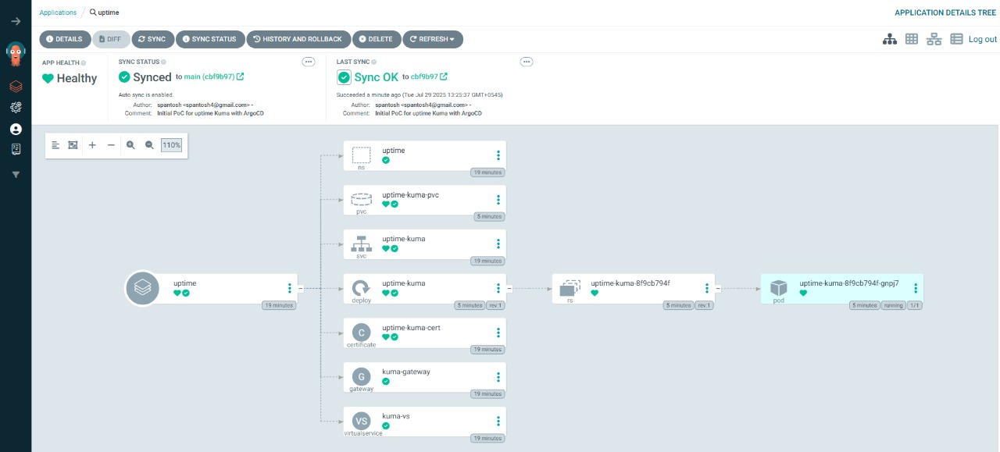
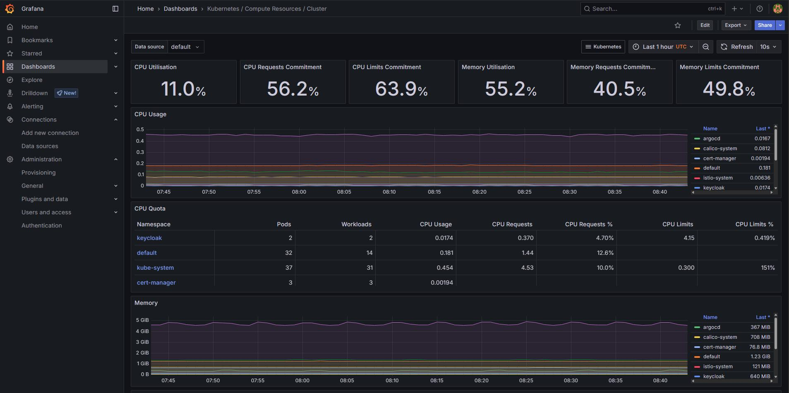
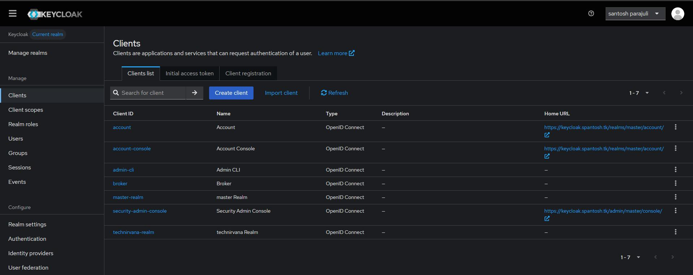

# 🧩 Kubernetes HA Cluster – PoC Deployment Report

This is a Proof of Concept (PoC) deployment of a **Highly Available Kubernetes cluster** using [RKE2](https://docs.rke2.io/) on a **Proxmox VE virtualized environment**. It demonstrates key aspects of Kubernetes HA, GitOps automation, observability, and secure ingress — all built on bare-metal infrastructure.

---

## 🚀 Project Goals

- 🔁 High Availability: Control Plane & Storage (Longhorn replication)
- 🔐 Secure Ingress with Istio & TLS via cert-manager
- ⚙️ GitOps deployment with ArgoCD
- 📦 Persistent volumes backed by Longhorn
- 📊 Cluster and application observability using Prometheus + Grafana

---

## 🖥️ Infrastructure Overview

| Component          | Details                             |
|-------------------|--------------------------------------|
| **Platform**       | Proxmox VE (bare-metal)             |
| **VMs**            | 3× control-plane, 2× worker nodes   |
| **Kubernetes**     | RKE2 (with embedded etcd)           |
| **Container Runtime** | containerd                      |
| **Load Balancer**  | HAProxy (ports 6443, 9345)          |

---

## 🔌 Networking & Ingress

- **CNI Plugin**: Calico
- **LoadBalancer**: MetalLB (Layer 2 mode)
- **Ingress Controller**: Istio Gateway + VirtualService
- **TLS Management**: cert-manager with Cloudflare DNS-01 challenge

---

## 📦 Persistent Storage

- **Longhorn**: Distributed, replicated storage
- Volume healing and multi-node resilience built-in

---

## 🔁 GitOps Workflow with ArgoCD

- GitOps-style deployment using **ArgoCD**
- Applications synced automatically from GitHub repo (branch: `main`)
- Helm used for templated Kubernetes manifests

### ✅ Uptime Kuma Deployment Example
- **Deployed via ArgoCD**
- **Ingress via Istio**
- **TLS via cert-manager**
- **Persistent Volume Claim backed by Longhorn**

📸 ArgoCD Tree View:  

---

## 📊 Monitoring & Observability

- **Prometheus**: Metrics collection (Kubernetes components, apps)
- **Grafana**: Custom dashboards (resource usage, pod health, etc.)

---

## 📄 Full Report

Read the full technical documentation:  
📄 [Kubernetes_PoC_Report.pdf](./Kubernetes%20PoC%20Report.pdf)

---

## 📷 Screenshots

| Component         | Screenshot |
|------------------|------------|
| ArgoCD View       |  |
| Grafana Dashboard |  |
| Keycloak UI       |  |
| ArgoCD App List   |  |

---

## 🧠 Key Technologies

- Kubernetes (RKE2)
- HAProxy
- Longhorn
- ArgoCD
- Helm
- Istio
- MetalLB
- Calico
- cert-manager
- Prometheus + Grafana
- Keycloak (OIDC Identity Provider)

---

## 🙌 Author

**Santosh Parajuli**  
📧 spantosh4@gmail.com  
🔗 [LinkedIn Profile](https://linkedin.com/in/santosh-parajuli)

---

## 🔖 Repository Tag

`#k8s-ha-cluster-poc`
